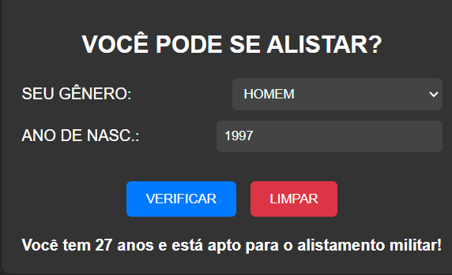

# ALISTAMENTO MILITAR
🆎VEJA SE VOCÊ ESTÁ APTO AO SERVIÇO MILITAR.

  

## DESCRIÇÃO:
Este projeto consiste em uma aplicação simples para verificar se uma pessoa está apta para o alistamento militar no Brasil. Aqui estão os principais recursos implementados:

1. Verificar Alistamento:
   - Ao clicar no botão "VERIFICAR", o sistema calcula se o usuário está apto para o alistamento militar com base no gênero e no ano de nascimento fornecidos.
   
2. Limpar Campos:
   - Ao clicar no botão "LIMPAR", todos os campos de entrada são resetados, incluindo o gênero selecionado e o ano de nascimento inserido, além de limpar o campo de resultado.

## EXECUTANDO O PROJETO:
1. Informar Gênero e Ano de Nascimento:
   - Selecione o seu gênero (HOMEM ou MULHER) no menu suspenso.
   - Insira o seu ano de nascimento no campo "ANO DE NASC.".

2. Verificar Alistamento:
   - Após fornecer o gênero e o ano de nascimento, clique no botão "VERIFICAR" para verificar o status de alistamento.

3. Limpar Campos:
   - Se desejar limpar os campos e os resultados, clique no botão "LIMPAR". Isso restaurará os campos para seus valores padrão e limpará o resultado da verificação.

## NÃO SABE?
- Entendemos que para manipular arquivos em `HTML`, `CSS` e outras linguagens relacionadas, é necessário possuir conhecimento nessas áreas. Para auxiliar nesse aprendizado, oferecemos cursos gratuitos disponíveis:
* [CURSO DE HTML E CSS](https://github.com/VILHALVA/CURSO-DE-HTML-E-CSS)
* [CURSO DE JAVASCRIPT](https://github.com/VILHALVA/CURSO-DE-JAVASCRIPT)
* [CONFIRA MAIS CURSOS](https://github.com/VILHALVA?tab=repositories&q=+topic:CURSO)

## CREDITOS:
- [PROJETO CRIADO PELO VILHALVA](https://github.com/VILHALVA)
- [ESTÁ DISPONIVEL NO SITE](https://vilhalva.github.io/STYLER/STYLER.html)

